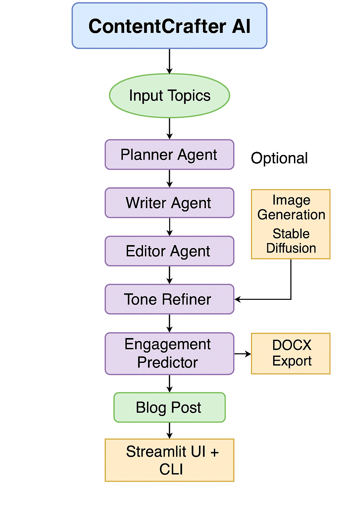

# 🧠 ContentCrafter AI

**ContentCrafter AI** is a powerful multi-agent blog generation platform built for the **Google Cloud Agent Hackathon**. It intelligently plans, writes, edits, tones, scores, and optionally illustrates full-length blog posts using **Gemini 1.5 Flash** and **Stable Diffusion v1.5**, exported directly to DOCX.

---
Built for the [Google Cloud Agent Development Kit Hackathon](https://googlecloudmultiagents.devpost.com/)  
🚨 **Fully working app**: [https://contentcrafterai.streamlit.app](https://contentcrafterai.streamlit.app)  
📽️ [Watch demo video](https://youtu.be/zw3HZQJf8RQ)  
🧵 Built by [Avisikta Pal](https://github.com/avisikta17pal) | [#adkhackathon](https://twitter.com/hashtag/adkhackathon)
---

## 🔥 Features

- ✅ Multi-agent blog generation (Planner → Writer → Editor → Tone Refiner → Engagement Predictor)
- ✅ Support for multi-topic input
- ✅ Dynamic topic validation and rejection
- ✅ Inline image prompt recognition:
  - `[Insert image here: ...]`
  - `(Image: ...)`
  - `(Infographic: ...)`
- ✅ Downloadable `.docx` files with embedded images
- ✅ Streamlit UI with rich Markdown + image preview
- ✅ GPU-powered image generation with RTX 4060 (Stable Diffusion)
- ✅ Graceful fallback for unsupported media (e.g., GIFs/videos)
- ✅ Modular agent design with orchestrator (`chain_agent.py`)

---


```markdown
## 🧠 Agent Pipeline




---

📂 Project Structure

ContentCrafterAI/
│
├── agents/
│   ├── chain_agent.py               ← Chains all agents
│   ├── planner_agent.py
│   ├── content_writer.py
│   ├── content_editor.py
│   ├── tone_refiner_agent.py
│   └── engagement_predictor.py
│
├── utils/
│   ├── logger.py
│   └── __init__.py
│
├── app.py                           ← Final Streamlit UI
├── main.py                          ← CLI entrypoint (optional)
├── .env                             ← API keys (excluded via .gitignore)
├── requirements.txt
├── architecture.png                 ← System diagram
├── demo_video.mp4                   ← Hackathon demo video
└── README.md                        ← This file

---

⚙️ Setup Instructions

1. Create virtual environment

     python -m venv new_venv
     new_venv\Scripts\activate          # (Windows)
     pip install -r requirements.txt
2. Configure .env

     GOOGLE_API_KEY=your_google_gemini_api_key
     HUGGINGFACE_API_TOKEN=your_huggingface_token
3. Run the app

     streamlit run app.py
App opens at: http://localhost:8501

---

🎨 Image Generation (Stable Diffusion)

Prompts supported:

     (Image: futuristic vertical farm)
     [Insert image here: moon base habitat]
     (Infographic: AI vs traditional farming)
✅ Uses RTX 4060 GPU with torch.float16 if available
✅ Falls back to CPU gracefully
⚠️ GIF/video prompts are skipped with warnings
🖼️ Images appear in both the UI and .docx downloads

---

📄 Example Input

Dream Cities of the Future: AI-Designed Societies in 2150
Quantum Education in Classrooms

---

📦 Output Includes

     📌 Content plan
     📝 Original and edited blog drafts
     🎯 Tone and structure improvements
     🔍 Engagement score
     🖼️ Inline illustrations (via prompt detection)
     💾 DOCX download with content + embedded images

---

✅ Hackathon Submission Checklist

| Item                                      | Status |
| ----------------------------------------- | ------ |
| Modular multi-agent pipeline              | ✅      |
| Gemini 1.5 Flash integration              | ✅      |
| GPU image generation with fallback        | ✅      |
| Inline image + infographic support        | ✅      |
| DOCX download with embedded images        | ✅      |
| Dynamic topic validation                  | ✅      |
| Streamlit UI                              | ✅      |
| CLI version (optional)                    | ✅      |
| Architecture diagram (`architecture.png`) | ✅      |
| README with setup instructions            | ✅      |
| Demo video (`demo_video.mp4`)             | ✅      |
| Blog post (optional)                      | ✅      |


---

🛠 Tech Stack

     LLM: Gemini 1.5 Flash (via google.generativeai)
     Image Gen: Stable Diffusion v1.5 (diffusers)
     Frontend: Streamlit
     Language: Python 3.10+
     Others: torch, python-docx, dotenv, huggingface_hub

---

🧪 Known Limitations

     ❌ GIFs and videos are skipped (not supported by Stable Diffusion)
     ⚠️ Some prompts may fail due to:
     GPU memory limits
     Malformed or overly complex text

---

## 🧭 System Architecture


🧠 Built For
     Google Cloud Agent Hackathon
     Powered by: Gemini + ADK + Diffusers

---

🙋‍♀️ Author
Avisikta Pal
🧠 Passionate about AI, creativity & innovation
🌐 https://github.com/avisikta17pal
📬 avisiktapalofficial2006@gmail.com
